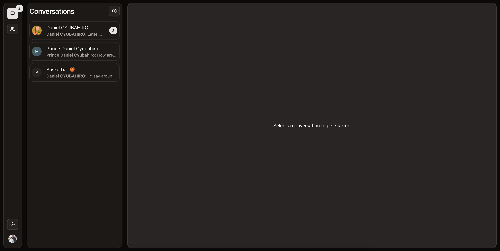
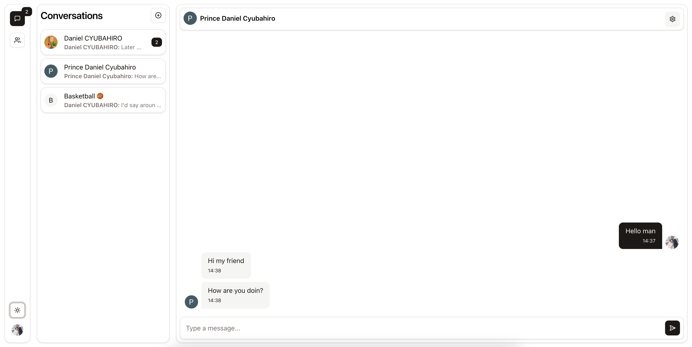
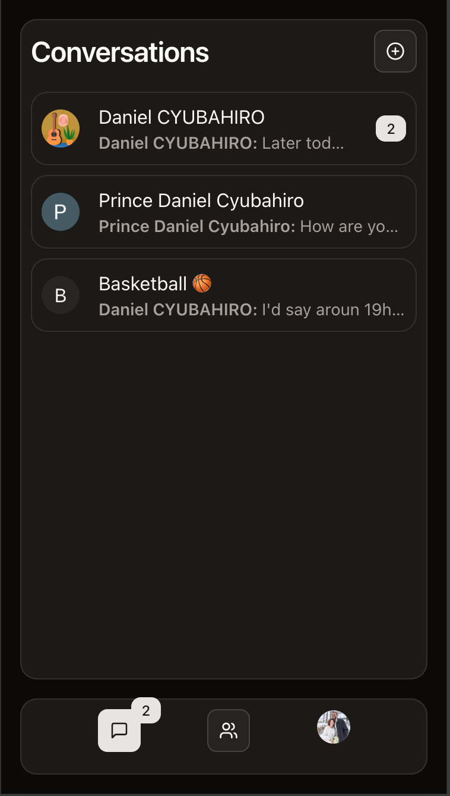
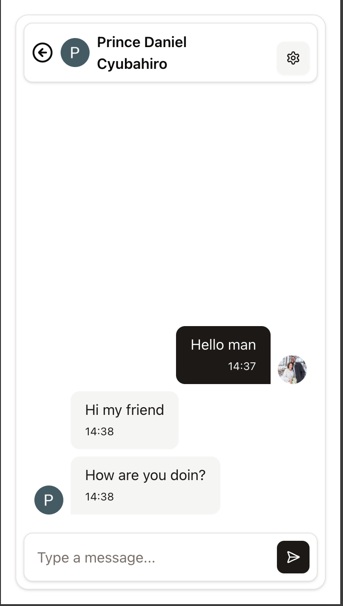

# 💬 Realtime Chat App

A full-featured realtime chat application built with **Next.js**, designed to offer seamless one-on-one and group
communication. This app supports friend requests, real-time messaging, group chat management, and much more — all with a
clean and modern UI.





|  |  |
|--------------------------------------------|--------------------------------------------|

---

## ✨ Features

- 🔐 **Authentication** powered by [Clerk](https://clerk.dev)
- 🧠 **Realtime Backend** using [Convex](https://convex.dev)
- 🧩 **UI Components** with [shadcn/ui](https://ui.shadcn.com)
- 🎯 **Form Handling** via [react-hook-form](https://react-hook-form.com)
- 💨 **Tailwind CSS** for modern utility-first styling
- 🔷 **TypeScript** for type safety and better developer experience

---

## 🧑‍🤝‍🧑 Core Functionality

- ✅ User authentication and profile management
- 🤝 Send, receive, and approve **friend requests**
- 💬 Realtime **one-on-one messaging**
- 👥 Create, leave, and delete **group chats**
- ⚡ Smooth and fast **real-time communication**
- 🗂 Clean and responsive UI with beautiful components

---

## 🚧 Coming Soon

We're actively working on adding more powerful features to enhance the chat experience:

- 😄 Send emojis in chat
- 🔊 Record and send **audio notes**
- 📹 Send **videos**
- 📄 Share **documents**
- 📞 **Video calling** functionality

Stay tuned! 🚀

---

## 🛠️ Tech Stack

| Tech            | Purpose                     |
|-----------------|-----------------------------|
| Next.js         | Frontend framework          |
| Clerk           | Authentication              |
| Convex          | Realtime backend & database |
| Shadcn UI       | Styled UI components        |
| Tailwind CSS    | Styling                     |
| React Hook Form | Form handling               |
| TypeScript      | Type safety & better DX     |

---

## 🧪 Running Locally

```bash
# 1. Clone the repo
git clone git@github.com:DanielCyubahiro/chat-app.git
cd chat-app

# 2. Install dependencies
npm install

# 3. Configure environment variables
(Refer to .env.example and add your Clerk & Convex keys)

# 4. Run the development server
npm run dev